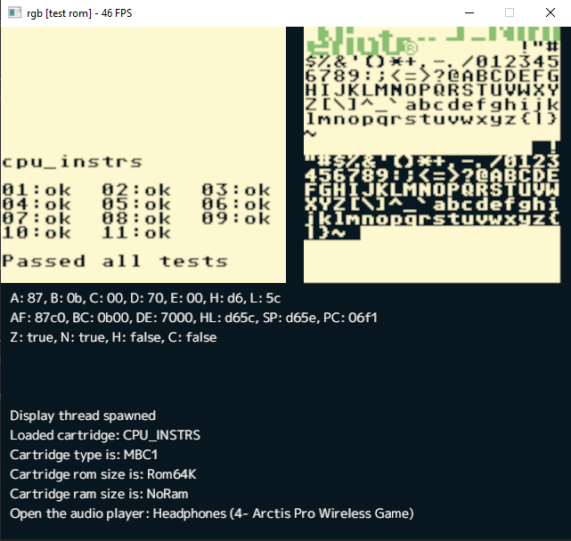
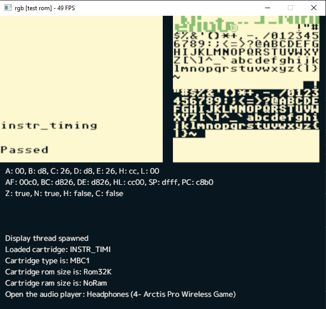
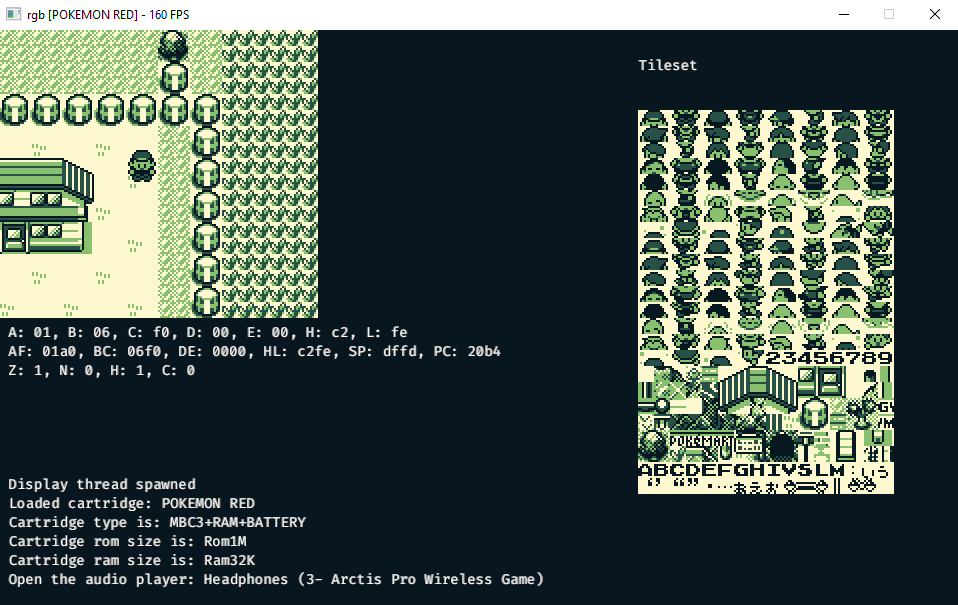

# RGB (Rusty GameBoy)

A gameboy emulator written in rust

## Goal
I started doing emulator development from chip-8. It was an awesome platform. Easy to develop and easy to understand.
I wanted more challenge, so I started with this.

What I plan to do achieve with this:

* DMG-01 emulation
* MBC1 + MBC3 implementation
* APU
* Usable debugger

There are a lot of gameboy emulator projects that are open source on GitHub. A lot of them are way better written.
This project written with most of the stuff broken up so future developer can use this
as a reference.

## Run
To run this project, you will need to have a copy of the DMG-01 bootrom. If you don't want to run with the bootrom simply remove the boot room parameter, but you won't be able to see the nintendo logo scroll up with the iconic beep.

To run:

```
cargo run -- -b DMG-01.bin -r [your game rom]
```

To run without bootrom

```
cargo run -- -r [your game rom]
```

## Test result

### Instruction test


### Instruction timing


### Pokemon Red


## Special Thanks
I've used so much online resource to help me understand the gameboy hardware and help me to write this vastly complicated emulator.

### Documentation
https://realboyemulator.files.wordpress.com/2013/01/gbcpuman.pdf

https://problemkaputt.de/pandocs.htm

https://gbdev.gg8.se/wiki/articles/Gameboy_Bootstrap_ROM

https://blog.ryanlevick.com/DMG-01/

### Repos
https://github.com/mohanson/gameboy

https://github.com/rylev/DMG-01

https://github.com/mvdnes/rboy

https://github.com/nwessing/gameboy

https://github.com/alexcrichton/jba

https://github.com/chrisbutcher/gameboy